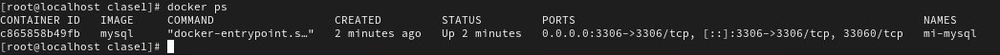
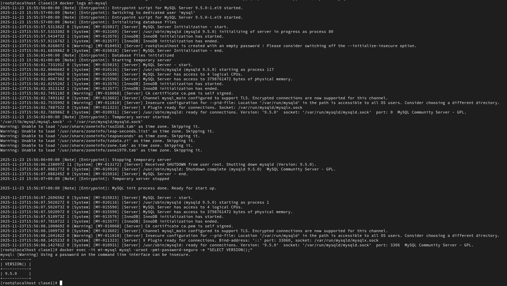

Nombre de la aplicación - Opción 3: MySQL (base de datos relacional)

Comandos ejecutados - Todos los comandos que usaste, uno por uno:

1. Comando docker run completo   
   docker run -d --name mi-mysql -p 3306:3306 -e MYSQL_ROOT_PASSWORD=mi-password-seguro mysql   

2. Comandos de verificación   
   docker ps   
   docker logs mi-mysql   
   docker exec -it mi-mysql mysql -uroot -pmi-password-seguro -e "SELECT VERSION();"   

3. Comandos de limpieza   
   docker stop mi-mysql   
   docker rm mi-mysql   
   docker ps -a   

Explicación breve - Qué hace cada flag del comando docker run que usaste   
   -d : Ejecuta el contenedor en segundo plano   
   --name : Asigna un nombre (mi-mysql) al contenedor   
   -p 3306:3306 : Mapea el puerto 3306 del host al puerto 3306 (interno) del contenedor   
   -e : Define una Variable de Entorno (MYSQL_ROOT_PASSWORD) necesaria para la configuración de MySQL   
   mysql : Especifica la imagen de Docker que se tulizará para crear el contenedor   

Evidencia:   

#### 1. Screenshot de docker ps mostrando el contenedor corriendo

#### 2. Salida de docker logs

#### 3. Screenshot o salida mostrando que el container fue eliminado correctamente

  
   
Qué aprendiste   
Aprendí la secuencia básica de Docker y la importancia de las Variables de Entorno (-e) para configurar servicios como bases de datos   

Dificultades encontradas y cómo las resolviste   
El contenedor no se ejecutaba porque no tenía Docker, se instaló docker de acuerdo con la guia dejada por el instructor.
