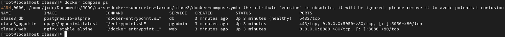
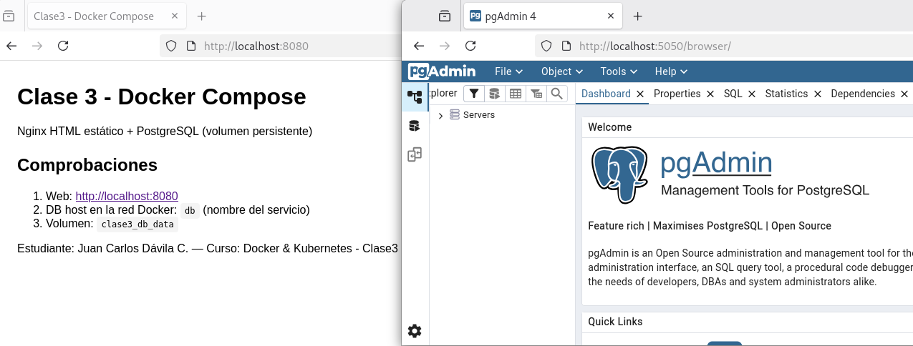
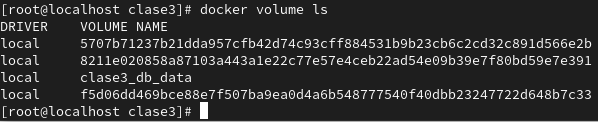
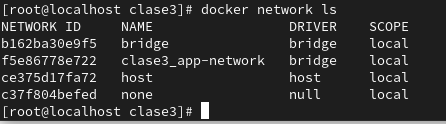

# Nginx + PostgreSQL - Clase 3

**Curso:** Docker & Kubernetes - Clase3  
**Estudiante:** Juan Carlos Dávila C.

nginx sirviendo contenido estático y PostgreSQL como base de datos persistente. Se demuestra el uso de Docker Compose, red custom y volúmenes.

## Stack
- **App:** Nginx (HTML estático)
- **Base de datos:** PostgreSQL
- **Orquestación:** Docker Compose

## Estructura
## 1. Clonar:

- git clone https://github.com/JCDC3/curso-docker-kubernetes-tareas.git
- cd curso-docker-kubernetes-tareas/clase3

## Levantar Servicios
- docker compose up -d

## Acceder
- API: http://localhost:8080
- PgAdmin: http://localhost:5050

## Como probar

## verificación

## 1. Servicios corriendo
- docker compose ps

## 2. Acceder a la web
- API: http://localhost:8080
- PgAdmin: https://localhost:5050

## 3. Verificar red personalizada:
- docker network ls

## 4. Verificar volumen persistente
- docker volume ls

## Conceptos Aplicados
- Docker Compose con tres servicios (web, db, pgadmin (opcional)
- Red custom: app-network
- Volumen named: clase3_db_data (persistente)
- Variables de entorno para PostgreSQL

## Capturas de pantalla

#### 1. Servicios corriendo  

#### 2. Aplicaciones web funcionando

#### 3. Volumen Persistente

#### 4. Mostrando la red custom

#### 5. Haciendo ping entre servicios
°[Ping entre servicios](screenshots/PingEntreServicios.png)

